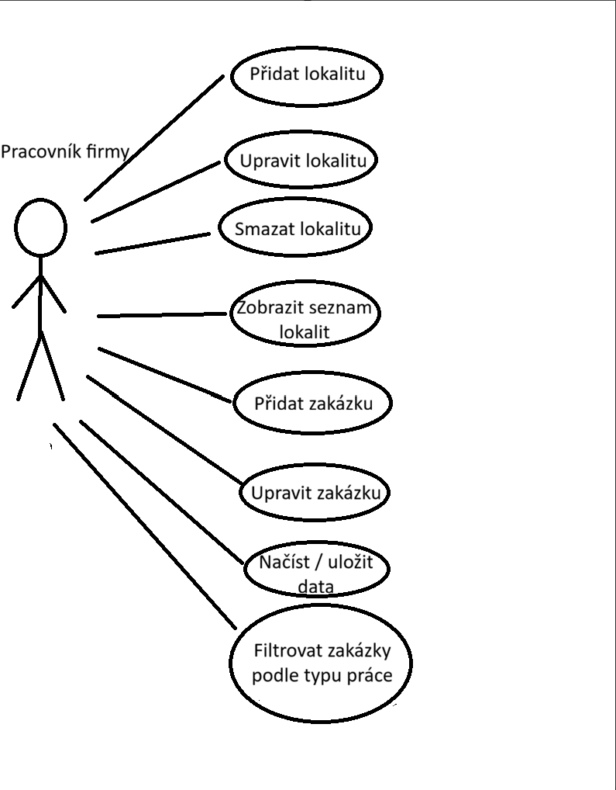
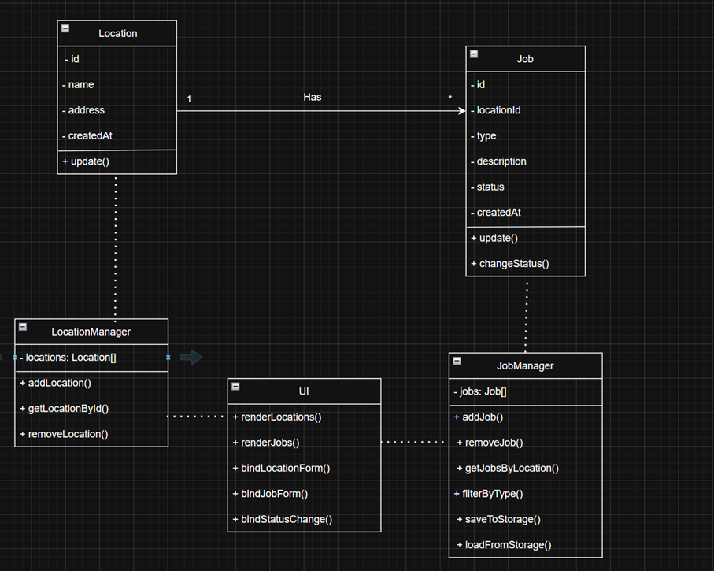

# Funkční specifikace aplikace

## Charakteristika aplikace

**Název aplikace:**  
Správa zakázek a lokalit – Topení, Voda, Plyn

**Popis:**  
Webová aplikace slouží k evidenci pracovních lokalit a zakázek firmy zaměřené na instalace a servis v oblasti topení, vody a plynu.  
Aplikace umožňuje uživateli přehledně spravovat jednotlivé lokality, k nim přiřazené zakázky, sledovat jejich stav a filtrovat práce podle typu.

Aplikace je navržena jako jednoduchý interní evidenční nástroj bez autentizace uživatelů. Veškerá aplikační logika je realizována na straně klienta a data jsou ukládána do LocalStorage webového prohlížeče.

---

## Charakteristika funkčností aplikace (Use Case diagram)

### Aktér
- Pracovník firmy

### Use Case diagram

### Popis případů užití

- **Přidat lokalitu**  
  Uživatel může založit novou pracovní lokalitu zadáním názvu a adresy.

- **Upravit lokalitu**  
  Slouží ke změně údajů existující lokality.

- **Smazat lokalitu**  
  Odstranění lokality z evidence včetně navázaných zakázek.

- **Zobrazit seznam lokalit**  
  Zobrazení přehledu všech evidovaných lokalit.

- **Přidat zakázku**  
  Vytvoření nové zakázky přiřazené ke konkrétní lokalitě.

- **Upravit zakázku**  
  Úprava popisu zakázky nebo změna jejího stavu.

- **Změnit stav zakázky**  
  Přepnutí stavu zakázky (plánováno / rozpracováno / dokončeno).

- **Filtrovat zakázky podle typu práce**  
  Filtrování zakázek dle typu práce (topení / voda / plyn).

- **Načíst / uložit data**  
  Automatické ukládání a načítání dat z LocalStorage.

### Vztahy mezi případy užití
- Zakázky jsou vždy navázány na konkrétní lokalitu.
- Jeden pracovník může spravovat více lokalit i zakázek.

---

## Uživatelské role a oprávnění

### Uživatelské role

| Role | Popis |
|----|----|
| Pracovník firmy | Interní uživatel aplikace |

### Oprávnění

- Správa lokalit (vytváření, úprava, mazání)
- Správa zakázek (vytváření, úprava, mazání)
- Změna stavu zakázky
- Filtrování zakázek
- Zobrazení přehledu všech prací

Aplikace neobsahuje autentizaci ani správu uživatelů.

---

## Uživatelské grafické rozhraní (GUI)

### Přehled rozhraní

Rozhraní aplikace je navrženo s důrazem na jednoduchost, přehlednost a intuitivní ovládání.

### Hlavní části GUI

#### Horní panel
- Název aplikace

#### Formulář pro přidání lokality
- Název lokality
- Adresa
- Tlačítko pro uložení

#### Seznam lokalit
- Název lokality
- Adresa
- Počet zakázek

#### Detail lokality
- Seznam zakázek přiřazených k lokalitě

#### Zakázka
- Typ práce (topení / voda / plyn)
- Popis práce
- Stav zakázky
- Akční tlačítka: upravit / smazat

---

# Technická specifikace

## Datový logický model

### Entita: Lokalita

| Atribut | Datový typ | Popis |
|------|-----------|------|
| id | number | Jedinečný identifikátor |
| name | string | Název lokality |
| address | string | Adresa |
| createdAt | date | Datum vytvoření |

### Entita: Zakázka

| Atribut | Datový typ | Popis |
|------|-----------|------|
| id | number | Jedinečný identifikátor |
| locationId | number | Vazba na lokalitu |
| type | string | Typ práce |
| description | string | Popis zakázky |
| status | string | Stav zakázky |
| createdAt | date | Datum vytvoření |

---

## Architektura aplikace

Aplikace je rozdělena do následujících částí:

### Prezentační vrstva
- HTML5 – struktura aplikace
- CSS3 – stylování a layout

### Aplikační logika
- JavaScript (ES6)
- Objektově orientovaný přístup
- Zpracování uživatelských událostí

### Datová vrstva
- LocalStorage
- Ukládání dat ve formátu JSON

---

## Popis tříd (Class diagram)

### Class diagram

### Přehled tříd

#### Třída: Location
- Uchovává informace o lokalitě
- Umožňuje aktualizaci údajů

#### Třída: Job
- Reprezentuje jednotlivou zakázku
- Obsahuje informace o typu práce a stavu

#### Třída: LocationManager
- Spravuje kolekci lokalit
- Umožňuje vyhledávání a mazání lokalit

#### Třída: JobManager
- Spravuje zakázky
- Filtrování dle typu práce
- Ukládání a načítání dat

#### Třída: UI
- Zajišťuje vykreslování dat
- Zpracovává uživatelské vstupy

---

## Použité technologie

| Technologie | Využití |
|-----------|--------|
| HTML5 | Struktura aplikace |
| CSS3 | Stylování |
| JavaScript (ES6) | Logika aplikace |
| OOP | Návrh tříd |
| LocalStorage | Ukládání dat |
| Git | Verzování projektu |

---

## Funkčnosti jednotlivých částí aplikace

### HTML stránky
- `index.html` – hlavní stránka aplikace

### Sekce aplikace z pohledu uživatele
- Evidence lokalit
- Evidence zakázek dle typu práce
- Přehled stavu zakázek
- Filtrování prací
- Automatické ukládání dat
